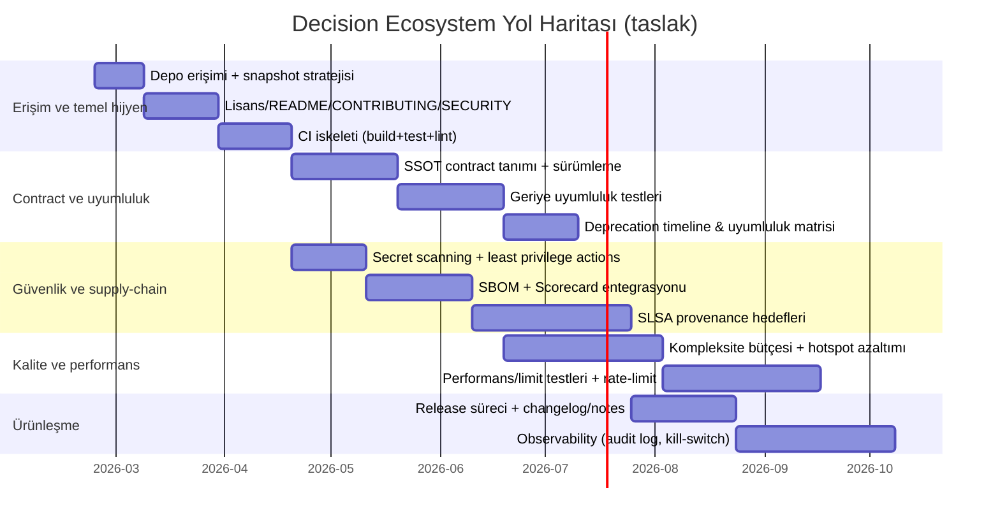
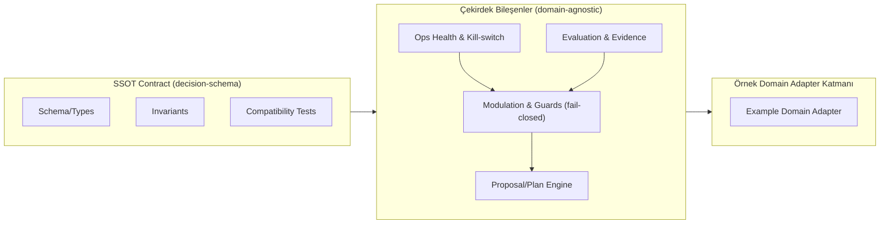

# decision-ecosystem Deposu İçin Statik Analiz Raporu

## Yönetici özeti

Bu raporun amacı, verilen URL’deki GitHub deposu (“decision-ecosystem”) üzerinde **kanıta dayalı (primary-source ağırlıklı)** bir statik analiz yapmaktır. Ancak, 2026-02-23 (Europe/Istanbul) itibarıyla depo URL’si dış erişimde **404 (Not Found)** döndürdüğü için depo içeriğine (README, kod, test, CI, lisans, issue, commit geçmişi) erişilememiş; dolayısıyla istenen analiz maddelerinin büyük kısmı **belirsiz (unspecified)** kalmıştır. citeturn1view0

Bu nedenle rapor iki katmanlıdır:

1) **Doğrulanabilir bulgular (kanıtlı):** Depo içeriği dışarıdan erişilemiyor → içerik tabanlı statik analiz yapılamıyor. citeturn1view0  
2) **Koşullu öneriler ve denetim çerçevesi (kanıt yoksa “varsayımsal/şablon”):** Depo erişilebilir olduğunda uygulanacak ölçülebilir statik analiz hattı, güvenlik/lisans/CI gereksinimleri ve “contract-first” mimari için invariant+test seti.

Özet önceliklendirme (erişim sağlandığında):  
- **P0:** Depo erişilebilirliğini sağlama (public/permission veya snapshot paylaşımı) + lisans/README/CI/test iskeleti.  
- **P1:** Contract-SSOT uyumluluk testleri, dependency/SBOM, supply-chain güvenliği (SLSA/Scorecard), gizli bilgi sızıntısı önlemleri.  
- **P2:** Kompleksite/kalite hotspot analizi, kapsam (coverage) metrikleri, mimari katmanlama ve deprecation/SemVer politikası.

## İnceleme kapsamı, yöntem ve kısıtlar

**Tanım (statik analiz):** Çalışan sistem davranışını gözlemlemeden; kaynak ağaç yapısı, bağımlılık manifestleri, derleme ayarları, testler, CI iş akışları, lint/format kuralları ve güvenlik yapılandırmalarından çıkarım yapma.

**Hedeflenen kapsam (kullanıcı talebi):**
- Depo yapısı, README/dokümantasyon, kaynak kod, testler, CI, lisans
- Issue/PR ve commit geçmişi (olgunluk sinyalleri)
- Dil/modül/bağımlılık haritası, kalite & kompleksite hotspot’ları
- Güvenlik/gizlilik, lisans uyumluluğu
- (Varsa) fizik/matematik temelli algoritma/model doğrulaması

**Kısıt (kanıt):** Verilen URL dış erişimde 404 döndürdüğünden içerik indirilememiştir; bu yüzden “repo içeriğine dayalı” tüm başlıklar **unspecified** olarak işaretlenmiştir. citeturn1view0

**Metodolojik not:** Bu raporda, depo içeriği olmadığı için:
- “Mevcut kod şu dildir/şu modül vardır” gibi iddialar **kurulmaz**.
- Yalnızca (a) erişim durumu, (b) erişim sağlanınca uygulanacak ölçülebilir analiz hattı ve (c) minimum proje hijyeni için koşullu öneriler verilir.

## Erişilebilirlik ve kanıtlanabilir bulgular

### Erişim durumu

- Verilen depo URL’sine dışarıdan erişim denemesi 404 (Not Found) ile sonuçlanmıştır. citeturn1view0  
- Bu durum tipik olarak şu senaryolardan birine karşılık gelir (ayırt edilemedi):  
  - Depo silinmiş/yeniden adlandırılmış,  
  - Depo private ve anonim erişime kapalı (GitHub private repo’lar için de 404 gösterebilir),  
  - URL yanlış veya organizasyon/owner farklı.

Bu ayrım, depo içeriğine erişemediğimiz için bu raporda **belirlenememiştir (unspecified)**. citeturn1view0

### “İstenen unsur” bazında durum tablosu

Aşağıdaki tablo, talep edilen inceleme maddelerinin **kanıt düzeyini** gösterir.

| İnceleme maddesi | Durum | Kanıt | Sonuç etkisi |
|---|---:|---|---|
| Repo yapısı (tree) | Erişilemedi | 404 | Modül/kapsam çıkarımı yapılamaz |
| README / docs | Erişilemedi | 404 | Amaç, kurulum, mimari beyanı doğrulanamaz |
| Kaynak kod analizi | Erişilemedi | 404 | Dil, bağımlılık, kalite/kompleksite ölçülemez |
| Testler / coverage | Erişilemedi | 404 | Test varlığı ve kapsamı **unspecified** |
| CI (GitHub Actions vb.) | Erişilemedi | 404 | Build/test güvenilirliği **unspecified** |
| Lisans | Erişilemedi | 404 | Lisans uyumluluğu **unspecified** |
| Issues / PR’lar | Erişilemedi | 404 | Olgunluk sinyalleri **unspecified** |
| Commit geçmişi / release/tag | Erişilemedi | 404 | Sürümleme ve geliştirme hızı **unspecified** |

Kanıt: citeturn1view0

## Statik analiz bulguları ve ölçülebilir kontrol listesi

Bu bölüm iki parçadan oluşur:
- **Bulgular:** Depo içeriği erişilemediği için “çıktı” üretilemedi (unspecified). citeturn1view0  
- **Erişim sağlanınca uygulanacak analiz hattı:** Ölçülebilir metrikler ve test/invariant’lar.

### Dil, modül, bağımlılık envanteri

**Mevcut durum:** Programlama dilleri, modül sınırları, paket manifestleri ve lockfile’lar **belirlenemedi**. citeturn1view0

**Erişim sağlanınca çıkarılacak ölçülebilir metrikler:**
- Dil dağılımı: `cloc` + GitHub linguist benzeri sınıflandırma (dosya uzantısı ağırlıklı).
- Modül grafı:  
  - import/require graph (dile göre: Swift Package Manager, Cargo, npm, Python import graph vb.)  
  - “core → SSOT” yön bağımlılığı invariant’ı (aşağıda).
- Bağımlılık tablosu: manifest+lock parse edilerek `(name, version, scope, transitive_depth)` çıkarımı.
- Supply-chain görünürlüğü: SBOM üretimi (SPDX/CycloneDX) + vulnerability scan (örn. OSV/NVD eşlemesi).

### Kod kalitesi ve kompleksite hotspot’ları

**Mevcut durum:** Fonksiyon bazlı kompleksite/duplikasyon/ölçülebilir kalite metrikleri üretilemedi (unspecified). citeturn1view0

**Formül (kompleksite):**
- Cyclomatic complexity (McCabe):  
  - Pratikte: `M = (#decision_points) + 1`  
  - Alternatif form: `M = E − N + 2P` (CFG kenar/düğüm/bileşen sayıları)

**Hotspot tanımı (ölçülebilir):**
- Hotspot = yüksek kompleksite *ve* yüksek değişim sıklığı (churn).  
  - `risk_score(f) = z(M_f) + z(churn_f) + z(defect_density_f)`  
  - Burada `z(.)` z-skor normalizasyonu; defect_density issue/commit etiketlerinden türetilebilir (erişim şart).

**Test/invariant:**
- `M_f ≤ T` eşiği (ör. core için T=10, schema/infra için T=15)  
- Hotspot’lar için: her PR’da “complexity budget” kontrolü (CI’da fail-closed).

### Bağımlılık tablosu (şu an: unspecified)

Kullanıcı talebi gereği bağımlılık tablosu formatı aşağıdadır; ancak depo erişilemediğinden içerik **boş/unspecified** işaretlenmiştir. citeturn1view0

| Bağımlılık adı | Sürüm | Kapsam | Risk (CVE/yaş/maintenance) | Not |
|---|---|---|---|---|
| unspecified | unspecified | unspecified | unspecified | Depo içeriği erişilemedi |
| unspecified | unspecified | unspecified | unspecified | Depo içeriği erişilemedi |

## Güvenlik, gizlilik, uyumluluk ve lisanslama riskleri

Bu bölümde iki tip çıktı vardır:
- **Repo-spesifik kanıtlı tespitler:** Yok (erişim yok). citeturn1view0  
- **Standartlara dayalı koşullu gereksinimler:** Repo erişilebilir olduğunda doğrulanabilir kontrol listesi.

### Lisanslama ve uyumluluk

**Mevcut durum:** Depoda hangi lisansın bulunduğu bilinmiyor → lisans uyumluluğu analizi **unspecified**. citeturn1view0

**Önerilen “contract-first” ekosistem kuralı:**
- Her paket/modül için lisansın **SPDX identifier** ile ifade edilmesi (örn. `MIT`, `Apache-2.0`, `AGPL-3.0-only`). SPDX lisans listesi bu kısa kimlikleri standartlaştırır. citeturn18search0  
- Top-level repoda:
  - `LICENSE` + `NOTICE` (varsa) + her dil ekosistemi için lisans alanları (package manifestlerinde)
  - Derleme çıktıları için lisans raporu (CI artefact)

**Invariant (ölçülebilir):**
- `license_id ∈ SPDX-License-List` (aksi halde CI fail) citeturn18search0

### Güvenlik gereksinimleri: fail-closed, secret hijyeni, supply-chain

**Mevcut durum:** CI/workflow yokluğu/varlığı bilinmediği için uygulanmış kontroller **unspecified**. citeturn1view0

**Koşullu (ama pratik) güvenlik çerçevesi:**

- Uygulama güvenliği gereksinimlerinin çerçevelenmesi için **OWASP ASVS**; web servisleri dahil modern uygulamalar için güvenlik gereksinim seti sağlar. citeturn19search0turn19search4  
- Yazılım tedarik zinciri için:
  - **SLSA**: kaynak→build→artifact hattında bütünlük seviyeleri ve ortak dil. citeturn20search0  
  - **OpenSSF Scorecard**: repo pratiklerini otomatik kontrol edip skorlayan araç (CI ile entegre edilebilir). citeturn20search4turn20search5  

**Secret/credential yönetimi (CI için):**
- GitHub Actions tarafında uzun ömürlü “cloud secret” taşımamak için OIDC ile kısa ömürlü token yaklaşımı önerilir. citeturn21search4turn21search2  
- “Least privilege” için workflow `permissions` minimizasyonu kritik bir pratik olarak belgelenir; izleme/öneri araçları da vardır. citeturn21search5  

**Dependabot / bağımlılık güvenliği (CI için):**
- Dependabot uyarıları ve güvenlik güncellemeleri; dependency graph üzerinden zafiyet bildirimleri üretebilir. citeturn21search3  
- GitHub Actions bağımlılıklarında semver kullanan aksiyonlarda Dependabot uyarılarının davranışı/koşulları belgelenmiştir (SHA pinleme vs semver farkları gibi). citeturn21search3  

**Invariant (ölçülebilir):**
- `no_secrets_in_repo`: Repo taramasında (trufflehog/gitleaks) “high confidence secret” = 0 (CI fail-closed)  
- `workflow_permissions_minimized`: Her workflow/job için explicit `permissions:` tanımlı olmalı; default geniş yetki yasak (CI fail).  
- `sbom_generated`: Her release build’de SBOM üretilmeli; doğrulanabilir şekilde artefact’a bağlanmalı (SLSA hedefleriyle uyumlu). citeturn20search0turn20search3  

## Olgunluk değerlendirmesi ve evrim yol haritası

### Geliştirme aşaması (prototype/alpha/beta/production) değerlendirmesi

**Mevcut durum:** Commit geçmişi, issue/PR trafiği, release/tag, CI geçmişi erişilemediği için olgunluk seviyesi bu raporda **sınıflandırılamaz (unspecified)**. citeturn1view0

**Erişim sağlanınca uygulanacak gerekçeli sınıflandırma rubriği (ölçülebilir):**

| Sinyal | Ölçüm | Prototype | Alpha | Beta | Prod-ready |
|---|---|---:|---:|---:|---:|
| Release/tag | SemVer tag sıklığı | 0–1 | ≥1 | düzenli | düzenli + LTS |
| CI güvenilirliği | Yeşil oranı | düşük | orta | yüksek | çok yüksek |
| Test kapsamı | line/branch coverage | yok/az | artıyor | hedefli | SLA’lı |
| Issue hijyeni | triage süresi, etiketler | yok | kısmi | iyi | SLO’lu |
| Supply-chain | SBOM + SLSA seviyesi | yok | planlı | kısmi | standart |

SemVer’in MAJOR/MINOR/PATCH anlamları ve “0.y.z = initial development” yorumu, sürümleme politikasını formalize etmek için kullanılabilir. citeturn17search0  

### Uygulama alanları ve gerçekçi evrim planı

Depo içeriği doğrulanamadığı için “hedef domain” beyanları bu raporda **kanıtlanamaz**; bu yüzden yalnızca **domain-agnostic** bir yol haritası verilir. citeturn1view0

Aşağıdaki roadmap; contract-first, güvenlik ve ölçülebilirlik odaklı bir “Decision Ecosystem” yaklaşımı için tasarlanmış **koşullu** bir plan şablonudur.

**Teknik riskler (ölçülebilir/izlenebilir):**
- Contract kırılması riski: “uyumluluk testleri” yoksa MAJOR kırılımlar fark edilmez → `compat_test_pass_rate` metriği ile izlenmeli.
- Supply-chain riski: bağımlılık çoğalınca saldırı yüzeyi artar → Scorecard skorları ve SBOM diff’i ile izlenmeli. citeturn20search4turn20search5  
- Gizli bilgi sızıntısı: özellikle CI log’larında token/PII görünmesi → secret scanning + log redaction.  
- Fail-open davranış: guard/kill-switch yanlış tasarlanırsa “kötü kararlar” üretime sızabilir → fail-closed invariant’ı.

## Öneriler, test/invariant seti ve patch planı

Aşağıdaki öneriler **repo içeriği görülmeden** yazılmıştır; dolayısıyla “mevcutta var/yok” denemez. Öneriler “yoksa ekleyin / varsa sertleştirin” şeklindedir. citeturn1view0

### Minimum artefact seti ve öncelik tablosu

| Öğe (dosya/yol) | Amaç | Kabul kriteri (ölçülebilir) | Öncelik |
|---|---|---:|---:|
| `README.md` | Proje amacı, scope, kurulum | Kurulum adımı + mimari diyagram + sürümleme politikası | P0 |
| `LICENSE` | Lisans belirliliği | SPDX uyumlu lisans metni + repo metadata | P0 |
| `SECURITY.md` | Zafiyet bildirim süreci | İletişim + SLA + supported versions | P0 |
| `CONTRIBUTING.md` | Katkı kuralları | PR şablonu + test koşulları | P1 |
| `.github/workflows/ci.yml` | Build/test/lint | Her PR’da çalışır; fail-closed | P0 |
| `.github/dependabot.yml` | Bağımlılık güncelleme | Haftalık update PR’ları + security updates açık | P1 citeturn21search3 |
| `.github/workflows/scorecard.yml` | Güvenlik pratik skoru | Scorecard raporu üretir | P1 citeturn20search4turn20search5 |
| SBOM üretimi (örn. `sbom/`) | Supply-chain şeffaflığı | Her release build’de SBOM artefact | P1 citeturn20search0turn20search3 |
| Release tags + SemVer | Uyumluluk iletişimi | `MAJOR.MINOR.PATCH` ve changelog | P1 citeturn17search0 |

### Contract-first için invariant ve test paketi

**Tanım:** “SSOT contract” (schema) değişiklikleri tüm core bileşenler için bağlayıcıdır; core’lar arası bağımlılık minimum olmalı, tercihen yalnızca contract’a dayanmalıdır.

**Önerilen invariant’lar (repo erişince otomatik test edilebilir):**
- **I1 — Bağımlılık yönü:** Core paketleri yalnızca SSOT contract’ına bağımlı olmalı (core→core import yasak).  
  - Test: statik import graph taraması; ihlalde CI fail.
- **I2 — SemVer uyumu:** Contract’ta “breaking change” varsa major artmalı; minor/patch semantiği SemVer’e uygun olmalı. citeturn17search0  
  - Test: “schema diff → semver bump rule” kontrolü (ör. JSON schema breaking-diff algoritması).
- **I3 — Fail-closed:** Guard/risk/kill-switch eksik veri durumunda “deny/hold” üretmeli (fail-open yasak).  
  - Test: property-based test: `missing_input ⇒ decision == HOLD | DENY`.
- **I4 — Secret redaction:** Log’larda token/PII pattern’i bulunmamalı.  
  - Test: CI log ve repo taraması (regex+entropy) → 0 bulgu.

### Fizik/matematik perspektifi: model/algoritma değerlendirme çerçevesi

**Mevcut durum:** Depoda matematiksel bir model/algoritma bulunup bulunmadığı **belirlenemedi**. citeturn1view0

**Eğer modeller varsa** (ör. skor/kalibrasyon/optimizasyon), aşağıdaki akademik doğrulama ekseni önerilir:

- **Doğruluk (correctness):**  
  - İddia edilen amaç fonksiyonu `J(θ)` tanımlı mı?  
  - Çıkarım/dönüşüm adımları için invariant’lar var mı? (ör. olasılıkların ∑=1 olması)
- **Sayısal kararlılık:**  
  - Condition number ve ölçekleme duyarlılığı; float taşması/alt taşması kontrolü  
  - Deterministic compute: aynı girdiye aynı çıktı (seed/FP determinism)
- **Hesaplama karmaşıklığı:**  
  - Zaman: `O(n)`, `O(n log n)`…  
  - Bellek: `O(n)`…  
  - Worst-case sınırları ve rate-limit/kota tasarımı
- **Uygunluk:**  
  - Domain-agnostic hedefle uyumlu mu? (hard-coded domain heuristics var mı?)  
  - Parametrizasyon contract içinde mi?

### Patch planı (erişim sağlanınca uygulanabilecek, dosya/yol bazında)

Aşağıdaki plan “eklenecek veya sertleştirilecek” öğeleri listeler; mevcut dosyalar görülmediği için “replace” değil “introduce/align” olarak düşünülmelidir. citeturn1view0

- `README.md`  
  - Mimari: SSOT + core + adapter ayrımı  
  - Uyumluluk matrisi ve deprecation politikası (SemVer referanslı) citeturn17search0  
- `LICENSE` + `NOTICE` (gerekiyorsa)  
  - SPDX identifier ile lisans beyanı; bağımlılık lisans raporu (CI) citeturn18search0  
- `.github/workflows/ci.yml`  
  - Aşamalar: format/lint → build → unit test → contract compatibility → SBOM → (opsiyonel) Scorecard  
  - Güvenlik: minimal `permissions`, secret sızıntısı taraması citeturn21search5turn21search4  
- `.github/dependabot.yml`  
  - Security updates açık; özellikle Actions bağımlılıkları için güncel kalma citeturn21search3  
- `.github/workflows/scorecard.yml`  
  - Scorecard raporu üretimi ve takip edilebilir hedef (örn. skor ≥ 7.5) citeturn20search4turn20search5  
- Supply-chain güçlendirme (SLSA hedefleri)  
  - Provenance üretimi ve artefact bütünlüğü hedefleri citeturn20search0turn20search3  
- Güvenlik gereksinimleri haritalaması  
  - OWASP ASVS’den hedeflenen seviye/kapsam seçimi (ürün tipine göre) citeturn19search0turn19search4  

**Swift/SwiftUI özel notu (koşullu):** Depoda Swift/SwiftUI modülleri varsa, kritik akışlarda yapılandırılmış log olayları (debug/warn/action/view/result) ve redaction uygulanması önerilir; ancak Swift varlığı bu raporda **tespit edilememiştir (unspecified)**. citeturn1view0