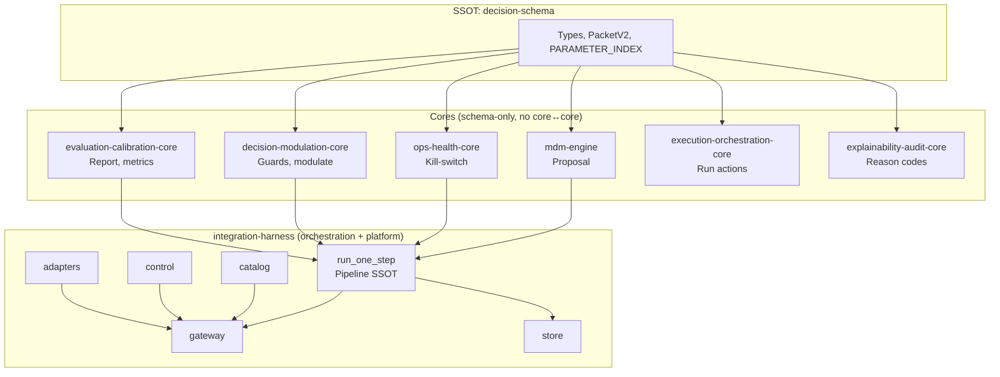

<!--
Decision Ecosystem — decision-ecosystem-docs
Copyright (c) 2026 Mücahit Muzaffer Karafil (MchtMzffr)
SPDX-License-Identifier: MIT
-->
# Decision Ecosystem — Görselleştirme (Architecture & Data Flow)

**Amaç:** Yapının ve veri akışının tek sayfada görsel karşılığı. Diyagramlar Mermaid ile; GitHub, GitLab ve Mermaid-destekleyen her yerde render edilir.

**Referanslar:** PLATFORM_PLACEMENT_AND_DEFAULTS.md, DECISION_CENTER_GAPS.md, ECOSYSTEM_GATES_AND_INVARIANTS.md.

---

## 1. Ekosistem genel görünüm

Tüm core’lar yalnızca **decision-schema**’ya bağımlı; core’lar birbirine bağımlı değil. Harness pipeline’ı orkestre eder ve platform katmanını sunar.



---

## 2. Pipeline veri akışı (tek adım)

`run_one_step(state, context)` içinde sıra: propose → ops → modulate → PacketV2 → report. Fail-closed: exception durumunda güvenli karar + packet.


---

## 3. Decision Center (platform katmanı)

Gateway isteği alır; adapter ile domain → (state, context) dönüşümü yapılabilir; catalog/control context’e eklenir; pipeline çalışır; store ile kayıt; yanıt döner.

```mermaid
flowchart TB
    subgraph client["Çağıran"]
        req[POST /decide veya /decision]
    end

    subgraph gateway["Gateway"]
        mw[Middleware\nsize, rate-limit]
        adj[Adapter?\ndomain → state, context]
        merge[Catalog + Control\ncontext merge]
        call[run_one_step]
        save[Store.save\noptional]
        resp[Response\npacket, final_decision]
    end

    subgraph platform["Platform bileşenleri"]
        cat[catalog]
        ctrl[control]
        st[store]
    end

    req --> mw --> adj --> merge --> call
    cat --> merge
    ctrl --> merge
    call --> save --> resp
    st --> save
```

---

## 4. Adapter katmanı (domain ↔ pipeline)

Adapter’lar yalnızca eşleme yapar: domain girdisi → (state, context); FinalDecision/Report → domain çıktısı. Tüm örnek adapter’lar `example_domain_*` prefix’i taşır (INV-ADAPTER-DOMAIN-LEAK-1).


---

## 5. Nasıl görüntülenir?

- **GitHub/GitLab:** Bu dosyayı açın; Mermaid blokları otomatik render edilir.
- **VS Code:** Markdown Preview Enhanced veya “Markdown: Open Preview” ile önizleme.
- **Çevrimiçi:** [Mermaid Live Editor](https://mermaid.live) — kodu yapıştırıp PNG/SVG dışa aktarabilirsiniz.
- **CLI:** `@mermaid-js/mermaid-cli` ile `mmdc -i ARCHITECTURE_VISUALIZATION.md -o out/` (blokları ayrı görsellere çıkarır).

---

**Son güncelleme:** 2026-02  
**Referanslar:** PLATFORM_PLACEMENT_AND_DEFAULTS.md, DECISION_CENTER_GAPS.md, REPO_REGISTRY.md
